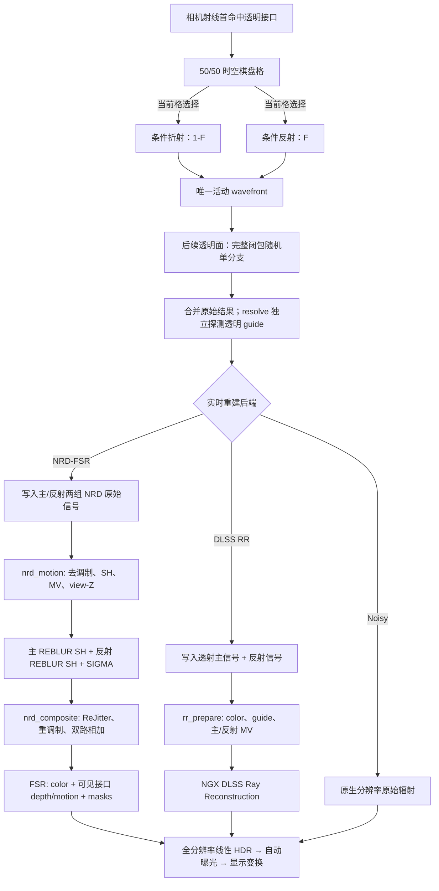

# 透明渲染与实时重建

本文记录 Prime 当前透明主路径从首命中棋盘格事件选择，到 Noisy、NRD-FSR 或 DLSS Ray
Reconstruction 输出之间的数据流。重点是各阶段“谁拥有哪一种几何、信号和时间相位”，
以及这些契约为什么不能互换。

本文只描述 `RealtimeRenderer` 的透明与重建契约。离线截图由独立 pipeline 以随机完整
反射/透射闭包追踪单路径，不继承首表面分叉；见[离线光传输契约](离线光传输契约.md)。

## 总体模型

透明主命中同时涉及三种不同意义的表面：

| 表面 | 含义 | 主要消费者 |
| --- | --- | --- |
| 可见接口 | 相机首先看到的玻璃、水或其他透明边界 | 最终轮廓、雾、FSR depth/motion、透明 mask |
| 透射替代表面 | 沿折射透射路径遇到的第一个可用非 delta 表面 | 主 NRD 历史或 RR 主表面 |
| 反射替代表面 | 沿条件反射路径遇到的第一个可用非 delta 表面或方向 | 反射 NRD 历史；RR 使用独立平面探针运动 |

核心约束如下：

1. 可见接口始终拥有屏幕轮廓和最终重建的几何覆盖。
2. 透射与反射是两条独立的光传输信号，不能共用一个 NRD 历史。
3. NRD 的重投影坐标与 FSR 的亚像素抖动是两份并行契约。NRD 输出稳定照明，组合阶段
   在当前像素执行官方 SG Resolve 和 ReJitter，恢复 FSR 所需的当前采样相位。
4. 当前帧材质、法线、粗糙度和 view-Z 已经由带抖动的相机射线采样，不能再随 NRD
   信号平移一次。
5. Noisy、NRD-FSR 与 DLSS RR 是互斥的完整实时后端；它们共享积分结果，但使用不同的
   输出适配。

### 为什么首透明面采用棋盘格单分支

这套模型是面向实时积分与重建的明确工程决策，不是对完整物理介质传输的等价化简。主要
原因有三项：

1. **折射链让 NEE 连接变得困难。** 普通阴影射线无法沿相机路径已经发生的多层折射反向
   连接光源；若要正确处理一串 delta 折射界面，需要求解满足各界面 Snell 约束的镜面链，
   并为连接的 Jacobian、PDF 与 MIS 建立一致契约。当前让透明 delta 顶点跳过 NEE，并让
   其他表面的阴影射线沿直线累计滤光，避免把一条错误弯折的可见性路径伪装成物理解。
2. **按 Fresnel 独立随机选择首面事件会让低能反射严重欠采样。** 两种事件指向不同半球、
   替代表面、深度、运动和有效方向；法线水面只有约 2% 的 Fresnel 反射样本。实时模式因此
   使用 50/50 时空棋盘格分层选择事件，并用独立探针持续提供两路 guide。选择概率进入 PDF，
   所以辐射估计仍无偏，重建身份也不随当前格采到的事件切换。
3. **更高级的采样算法超出当前实时预算。** 恢复物理折射链的可用直接光采样，通常需要
   MNEE/流形求解、双向连接或针对镜面链的专用 guiding/reservoir 与 MIS。它们会增加迭代
   求解、额外光线、每路径状态、显存和 GPU 分歧；Prime 当前的 wavefront、双路重建与高
   视距场景预算难以同时承担这些成本。实时积分器保留现有灯光树、长尾队列和完整 NEE。

因此最终语义选择“首透明接口 50/50 棋盘格单分支、后续透明接口按完整闭包随机单分支、NEE
阴影不折射只累计直线吸收、两路重建使用独立探针”。它保住首可见面的稳定重建身份，并且每个像素
每帧最多延续一条透明辐射路径。



## 1. 首个透明接口的棋盘格选择

普通主命中继续使用一条 wavefront 路径。首个可见表面为透明接口时，
`primeInitializeTransparentWavefront` 复用同一次命中、材质翻译、闭包构造和局部视角，
然后调用透明适配层的条件 proposal 入口，得到：

- 槽 0：条件透射路径；光滑界面按几何法线与 IOR 产生响应为 `(1-F) / η²` 的确定性折射，
  粗糙界面从完整微表面闭包中只采样透射半球；
- 槽 1：条件反射路径；光滑界面为镜面事件，粗糙界面只采样反射半球。

两个槽继续保存独立的辐射和 guide 历史，但只有当前像素/帧棋盘格选中的槽获得 throughput、
介质栈并进入 wavefront 队列；另一个槽本帧不延续传输。分支类别仍进入 SER coherence hint。

“第一个”严格指相机主射线的首个可见面。主射线先命中不透明面后遇到的透明面不会分叉。
光滑首面的反射响应包含 `F`，折射响应使用互补权重 `1-F`；粗糙首面保留闭包自身的 Fresnel、
有限立体角响应和在所选半球内归一化的条件 PDF。被选事件的条件 PDF 再乘 `0.5`，使两帧/
相邻像素的期望仍为两路贡献之和。后续再次命中透明材质时不会扩张路径树，而是从 RoboCute
完整透射闭包随机选择一个反射或折射事件；只有实际折射事件更新介质栈。

零粗糙度透明面的条件 proposal 为纯 delta。后续零粗糙度透明面随机选择一个 delta 反射或
折射事件且不执行 NEE；粗糙透明面的首面条件分支和后续完整闭包都提供一致的
sample/eval/PDF。所有实际散射（包括纯 delta 透明界面）统一计入 bounce，并从第二次散射
开始 Russian roulette。透射事件把 `relativeEta²` 累积到 `etaScale`，实时存活率采用
`min(max(throughput) × etaScale, 1)` 的 PBRT 风格线性度量；不再为透明链维护独立 RR 深度。
队列以 FP16 保存 `etaScale`，存活路径按所用概率重加权，因此量化只影响方差，不改变期望。

### 材质语义

- 图元 UV 范围中心的 mip-0 alpha 用于稳定区分 Vanilla 染色玻璃与普通玻璃；当前位置的
  纹理 alpha 只选择表面语义，不连续缩放任何参数。染色玻璃 alpha `<= 0.5` 的 texel 为
  光滑介质界面，alpha `> 0.5` 的 texel 为粗糙介质界面；两者的体积吸收都锁定以 alpha
  `0.4` 按原版 encoded-sRGB 混色标定的一米透射率，并按实际段长产生 Beer-Lambert 吸收。
  玻璃板沿用相同颜色标定，薄壁闭包按 1/16 米名义厚度处理。
- 普通玻璃的主体是无色光滑介质，既没有表面滤色也没有体积吸收；alpha `> 0.5` 的纹理
  边框改按不透明粗糙漫反射材质着色和遮光，不进入玻璃介质。两类粗糙区域都优先采用
  LabPBR 粗糙度；资源包未提供时采用“缺省材质粗糙度”设置。alpha 只决定是否粗糙，
  不决定粗糙度数值。
- “无缝玻璃”默认开启。启用时 alpha 不再选择上述装饰语义：普通玻璃所有 texel 都按无色
  光滑主体着色和滤光，染色玻璃所有 texel 都按光滑染色界面着色；稳定材质参考、alpha
  `0.4` 的染色吸收和实际介质段长不变。关闭后才恢复粗糙/边框分类。
- 水使用实测纯水 RGB 消光。只有采到实体介质的折射事件才在进入/退出时更新介质栈；玻璃
  与水都保存各自的 IOR 和消光。
- 首面条件折射使用适配层的几何 Snell 方向与互补 Fresnel 权重；后续随机单分支恢复完整
  闭包的 Fresnel、PDF、`relativeEta` 与透射 `/η²` 响应；首面条件折射也应用相同的
  辐亮度 `/η²` 约定。
- 树叶薄壁透射保留原闭包，不按玻璃处理。

这是面向实时重建的分层估计器：首可见面使用棋盘格条件单分支，后续顶点使用完整闭包
单分支。它不等于完整物理介质传输，尤其没有改变直线透明阴影近似。

### NEE 透明滤光

NEE 阴影 payload 同时携带 RGB 光学厚度矩、普通终点介质消光、两项起点介质栈及各自绕数和真实遮挡距离：

- 起点在介质中时，分别保存最多两项栈消光并把有效项绕数初始化为 1，不预乘 `tMax`；
- 两层嵌套使用差分基底 `E0` 与 `E1-E0`。因此内层区域恢复为 `E1`，退出内层后恢复
  `E0`，退出外层后恢复为零；外层吸收不会与内层相加；
- 每个实体玻璃或水边界按自己的 RGB 消光累计带符号的一阶矩：进入边界加
  `-extinction × t`，退出边界加 `extinction × t`。与起点介质匹配的水或染色玻璃直接复用
  路径携带的消光并增减整数值绕数；其他边界相应增减普通终点消光。最终光学厚度为
  `moment + endpointExtinction × tMax`，其中两层终点状态直接按
  `E1 × w1 + E0 × (w0-w1)` 求值，避免在乘 `tMax` 前计算 `E0+(E1-E0)`。这与按区间长度积分等价且不依赖
  any-hit 调用顺序，同时避免水下太阳射线用两个 `extinction × 1000000` 大数相减恢复
  几格水程所产生的 RGB 浮点消去；
- 起点介质与边界消光都先规范化为 Wavefront 记录使用的 fp16 表示；同一介质的不同几何面
  允许一个 fp16 量级的重建差异。匹配后不再做 RGB 浮点相减，只通过绕数抵消；因此队列
  解包值与另一面的材质重建值之间的逐通道微小差异不会再被太阳的百万单位 `tMax` 放大；
- 玻璃阴影以图元 UV 范围中心的 mip-0 texel 作为位置不变的材质分类和颜色参考；染色玻璃
  始终使用 alpha `0.4` 的消光，不让粗糙边框的 alpha 改变介质参数；普通玻璃主体消光为零，
  关闭“无缝玻璃”时由 alpha `> 0.5` 的漫反射边框产生真实不透明遮挡；默认开启时，该边框
  与主体一样只产生零消光透明边界；
- 零体积薄壁界面按 1/16 米名义厚度除以入射余弦累计一次光学厚度，并钳制到射线长度；
- 加减和不依赖 any-hit 调用顺序；畸形边界通过末端钳制避免负吸收或能量放大；
- 不透明面以及通过 alpha 测试的 cutout 保持真实遮挡，只有它们更新 SIGMA penumbra
  使用的遮挡距离。

玻璃和水的 RGB 透射预乘到太阳或面光源 radiance；标量 visibility 只表示真实遮挡。
阴影路径不计算透明面的折射、后续 Fresnel 损失或反射分支，始终沿原 NEE 线段累计吸收。

### 分支辐射的归属

分支完成后，`primeResolveTransparentWavefrontResult` 把结果组织为：

| `PrimeIntegrationResult` 字段 | 透明像素中的含义 |
| --- | --- |
| `radiance.diffuse/specular` | 折射透射分支的辐射 |
| `reflectionDiffuseRadiance/reflectionSpecularRadiance` | 条件反射分支的辐射 |
| `guides` | 真实可见接口 |
| `transmissionGuides` | 透射替代表面 |
| `reflectionGuides` | 反射替代表面或方向 |

这里的 diffuse/specular 首先是重建信号分类，不表示透明接口本身只发生某一种事件。
例如 RR 输出适配会把整个透射分支并入主信号，把整个反射分支并入 specular 信号。

## 2. PSR guide 的构造

NRD 不能用玻璃接口的位置重投影玻璃后的照明，也不能用同一个位置同时描述透射和反射。
实时 resolve 因此把辐射采样与重建观测分开：透明像素重新确认首接口后，独立
追踪一条确定性平滑透射 guide 和一条首接口平面反射 guide。探针不修改主路径的
throughput、radiance、介质栈或随机状态，但其自身会按每段介质长度累计 Beer-Lambert
透射率，使目标反照率与已吸收的辐射保持同一重建语义；已有分支捕获只作为探针无效时的回退。

确定性透射探针穿过一串平滑透明接口时，`PrimeQueuedPsrState` 以首段方向、累计路径长度和
反射旋转保存一个最多八层的有界链。每个接口固定选择透射，TIR 才确定性反射；遇到首个
非透明或粗糙透射表面后构造：

```text
virtualPosition = firstDirection * totalPathLength
virtualNormal   = accumulatedReflectionTransform(targetNormal)
```

透射分支还计算目标平面与可见主射线的交点距离：

```text
anchorDistance =
    dot(target - camera, targetNormal)
    / dot(visiblePrimaryDirection, targetNormal)
```

这个 anchor 让折射路径的目标深度锚定在当前像素的可见主射线上。相机静止时，它投影回
当前带抖动样本位置，避免把虚拟 guide 的路径距离误报为物体运动。

探针同时用 payload 中的上一帧表面位置重建 previous virtual position。DLSS RR 会消费这个
位置生成主/反射 motion，所以目标或透明接口发生平移/形变时不再固定为零；缺少有效上一帧
位置时仍安全回退当前位置。NRD 仍使用自己的两分支 raw-position 契约。

平面反射探针沿首接口的确定性 delta 反射方向追踪一次。有限目标命中时，将当前与上一帧
目标点分别关于当前/上一帧接口位置镜像，得到可投影的 virtual position；命中天空时保存
平移无关的 virtual direction。该几何对平移的平面反射与目标运动精确；payload 没有上一帧
法线，所以接口旋转或强形变仍是近似。粗糙反射不采用单一平面虚像。

如果没有遇到有效替代表面、delta 链溢出或平面交点退化，guide 回退到已有分支捕获或真实
可见接口。回退只影响重建 guide，不截断或伪造原始传输。

不同后端启用的 guide 不同：

| 后端 | 透射 PSR | 反射 PSR |
| --- | --- | --- |
| NRD-FSR | 启用 | 启用 |
| DLSS RR | 启用 | 独立平面探针只提供 reflection MV，不提交第二主表面 |
| 禁用后处理 | 禁用 | 禁用 |

透射探针的上限与完整路径预算一致，并保留两套 96 字节重建槽，但每帧只有棋盘格选中的
一槽进入队列。反射探针额外追踪一次平面镜像目标。NRD 因而在两种棋盘格单元上都获得稳定
的透射/反射表面身份，DLSS RR 同时获得上一帧镜像目标或天空方向来生成 reflection motion。

## 3. 公共输出边界

`wavefront_output.glsl` 是积分器与实时重建之间的适配层。积分器只返回一个原始模型样本；
这里才根据后端把它编码为直接显示、NRD 或 RR 所需资源。

所有实时后端共享以下规则：

- 辐射是 D65、线性 Rec.2020、scene-referred HDR；
- 相机样本位置为 `pixelCenter + currentJitterPixels`；
- 数值、距离和 albedo 在写入 FP16/外部 SDK 边界前完成有限性与范围处理；
- 天空和确定性发光保存在 stable radiance 中，不建立第二份时间历史；
- 真实可见接口信息单独保留，不能被透射 PSR 覆盖。

后端选择集中在 `ReconstructionBackendRegistry`。它把配置解析为 `ResolvedReconstruction`，
再由对应 `VulkanReconstructionProcessor` 消费统一的 frame token、jitter、reset、raw frame
并输出全分辨率线性 HDR；不同后端的资源与命令流不会同时运行。

## 4. NRD-FSR 路径

### 4.1 Raygen 写入两组独立信号

NRD 模式启用 SH 输入。Raygen 写出两套完整的原始资源：

| 主 REBLUR 输入 | 反射 REBLUR 输入 |
| --- | --- |
| 透射辐射；普通像素则为普通主信号 | 透明条件反射辐射；其他像素无效 |
| 透射 PSR position/normal/roughness/material | 反射 PSR position/normal/roughness/material |
| diffuse/specular albedo 和 hit distance | 独立 albedo 和 hit distance |
| diffuse/specular 有效方向 | 独立有效方向 |

可见接口另外写入 `primeNrdDisplayPosition`：

- `xyz`：相机到真实可见接口的位置；天空为零；
- `w`：可见材质 flags 的 bit 表示。

因此 NRD 可以在虚拟表面上稳定两条照明历史，而组合和 FSR 仍知道屏幕上真正可见的是
哪一个接口。

反射 guide 无效时只把 `reflectionMaterial.a` 写为负值。`nrd_motion.comp` 在读取其他
反射资源前检查这个 marker，并把整条分支清为空输入，避免读取未定义的 companion 数据。

### 4.2 `nrd_motion.comp` 的输入准备

`primePrepareBranch` 分别处理主分支和反射分支。其输出遵循 NRD 4.17.4 的
`REBLUR_DIFFUSE_SPECULAR_SH` 契约：

1. 用分支自己的 position、normal、roughness 和 material 计算 view-Z 与重投影。
2. 运动向量满足 `old = new + MV`：

   ```text
   MV.xy = (previousUv - currentSampleUv) * renderExtent
   MV.z  = previousViewZ - currentViewZ
   ```

   NRD common settings 再用 `1 / renderExtent` 缩放 XY。方向型反射 guide 使用
   `w = 0` 投影且 `MV.z = 0`。
3. noisy diffuse/specular 分别除以对应 albedo，得到去调制照明。
4. SH0 保存照明的 YCoCg、归一化 hit distance；SH1 保存
   `effectiveDirection * luminance`。
5. 法线、线性粗糙度和 NRD material ID 被打包到 normal/roughness。透明主射线的
   position、normal、roughness 仍来自透射 PSR，但 material ID 保留可见透明界面的重建类，
   防止玻璃历史与后方表面的直接视图互换；DLSS RR 仍使用目标表面分类。

`currentSampleUv` 明确包含本帧 jitter。静止几何用非抖动历史矩阵投影后应回到这个 sample
UV，所以其物体运动为零；不能再减像素中心，否则 Halton 偏移会泄漏进每个静止 MV。

### 4.3 FSR guide 与 NRD guide 分离

同一 pass 中的 `primePrepareFsrGuide` 不读取透射或反射 PSR，而只读取
`primeNrdDisplayPosition`：

- 有表面时，depth 来自真实可见接口的 view-Z；
- motion 来自真实可见接口上一帧投影；
- 天空 depth 为 0，motion 只描述相机旋转。

这是最重要的分层之一：NRD 重投影“照明属于哪个虚拟表面”，FSR 重建“屏幕上哪个真实
表面覆盖这个像素”。把两者统一成一个 position 会让玻璃内部与边框产生相对滑动。

### 4.4 两个 REBLUR SH 历史

一个 NRD instance 内含：

- 主 `REBLUR_DIFFUSE_SPECULAR_SH`：普通表面和透明透射 PSR；
- 反射 `REBLUR_DIFFUSE_SPECULAR_SH`：只处理透明条件反射；
- `SIGMA_SHADOW`：普通主表面的太阳可见性。

主 REBLUR 最多积累 63 帧主历史、63 帧 stabilized history 和 10 帧 fast history。反射
REBLUR 保留 63 帧主历史，但 stabilized history 上限为 10；粗糙度低于 0.1 时启用
responsive accumulation，最低积累 3 帧。两者都使用 4 帧 history fix、5×5 hit-distance
重建和 1.5 的 sporadic-outlier relative scale。

NRD 接收当前与上一帧 jitter，但输出仍是为时间稳定设计的 SH 照明。组合阶段必须按 NRD
官方规则在当前像素执行 SG Resolve 和 ReJitter，再交给 FSR。

### 4.5 组合与透明相位恢复

`nrd_composite.comp` 负责三件事：

1. 按 NRD 官方 SH/SG 规则 Resolve 和 ReJitter；
2. 用当前材质 albedo 重调制照明；
3. 用官方 ReJitter 的乘性幅度修正恢复当前亚像素采样的微细节。

普通不透明与透明分支都只读取当前像素的 SH0/SH1，并使用该像素的 current normal、
roughness、view、view-Z、material 和 albedo：

```text
unpack current-pixel SH
→ SG diffuse/specular resolve
→ official ReJitter scale
→ diffuse/specular remodulation
```

透明像素分别 resolve 透射主分支和条件反射分支，再与 stable radiance 相加。当前 guide、
albedo 和真实可见覆盖已经由 `pixelCenter + jitter` 的射线生成；不能再按 camera jitter
空间平移 denoised SH。额外平移会在官方 ReJitter 之后重复恢复相位，并跨几何边界读取
不属于当前像素的照明。

### 4.6 ReJitter 边界

ReJitter 只读取四邻域 normal 和 view-Z 来估计中心 BRDF 相对邻域平均值的幅度修正，不读取
邻居 SH、material 或 albedo。四个邻居必须同时通过 view-Z 对称性检查，且法线与中心位于
同一半球；正交或反向的硬几何边界直接使用单位幅度，避免墙角稳定亮边。透明主分支另以
可见透明界面的 NRD material class 隔离历史，不能与后方表面的直接视图交换样本。

### 4.7 重调制、合成和大气

每条分支的 resolved diffuse/specular 分别乘回自己的 albedo。主分支还加入 SIGMA
过滤后的太阳信号，然后：

```text
linearHDR =
    primarySurface
    + reflectionSurface
    + stableRadiance
```

大气透射和 inscatter 按真实可见接口距离应用。天空只返回 stable radiance，不读取
REBLUR 的旧表面历史。最终写入 FSR 的仍是线性 Rec.2020 HDR；自动测光、最终曝光和
Oklab 显示变换必须留在超分之后。

### 4.8 FSR 输入

FSR 接收：

| 输入 | Prime 契约 |
| --- | --- |
| color | 上述 NRD composite，渲染分辨率线性 HDR |
| depth | 可见接口 reversed-infinite depth：`near / viewZ`；天空为 0 |
| motion | `previousUv - currentSampleUv`，归一化 UV |
| reactive mask | 当前透明、树叶和普通材质都为 0 |
| transparency/composition mask | 透明材质为 1；动画纹理为 0.75；其他为 0 |

主机把 motion scale 设为渲染宽高，使归一化 UV motion 在 FSR 内恢复为像素。Prime
raygen 使用 `pixelCenter + j`，而 FSR API 的 jitter offset 表示投影位移，因此跨 API
边界时提交 `-j`。

透明材质使用 T&C mask，而不是接近 1 的 reactive mask。T&C 让 FSR 对颜色运动与几何
运动不完全一致的反射/透射使用较软历史；高 reactive 会直接丢弃历史并重新暴露相机
jitter。树叶拥有匹配的 depth/motion，不标 T&C，以保留 FSR 的 thin-feature lock。

FSR 3.1.4 输出全分辨率线性 HDR，随后 Prime 统一执行自动测光、最终曝光，以及线性
Rec.2020 到显示 sRGB 的 Oklab 变换。

## 5. DLSS Ray Reconstruction 路径

DLSS RR 是另一条完整后端，不先运行 NRD，也不再运行 FSR。它与 NRD-FSR 共享透明材质
分叉，但输出适配不同。

### 5.1 透明信号分组

RR 只有一组主表面输入和一组 reflection motion，不能像 Prime 的 NRD 后端那样提交两套
独立 REBLUR guide。透明结果因此被组织为：

```text
RR primary/noisy-diffuse = transmission.diffuse + transmission.specular
RR specular              = reflection.diffuse + reflection.specular
```

如果透射分支存在有效 PSR 和 anchor：

- 主 position 使用透射目标的 anchor，但沿真实可见主射线放置；
- 主 normal/roughness 使用透射替代表面；
- diffuse albedo 使用透射替代表面；
- specular albedo 和反射粗糙度来自真实可见接口；
- 可见接口距离继续单独保存，用于大气；anchor 距离单独保存，用于重建当前主位置。

发生目标运动时，raygen 将透射探针的上一帧 virtual position 写入主位置 scratch；当前
anchor position 由当前像素主射线和独立 anchor 距离恢复。没有有效透射 PSR 时，主 guide
回退到真实可见接口。RR 模式不提交独立反射主表面，只保留一张 RGBA32F 的上一帧反射
virtual target scratch，供 prepare 生成 reflection motion。

### 5.2 `rr_prepare.comp`

RR prepare pass 把 raygen scratch 转成 NGX 的低分辨率输入：

- `inputColor`：透射、反射、太阳和 stable radiance 的模型总和，再按可见接口应用大气；
- diffuse/specular albedo：RGBA16F；
- normal/roughness：RGBA16F 世界法线与线性粗糙度；
- linear depth：R32F 正 view-Z，天空使用 65504；
- primary motion：RG16F 归一化 UV；
- reflection motion：RG16F 归一化 UV。

主 motion 与 NRD/FSR 同样满足 `previousUv - currentSampleUv`。当前 sample UV 包含 jitter，
所以静止表面和静止天空的 motion 为零。NGX 接收低分辨率 motion，并用渲染宽高作为
motion scale。

平滑反射满足以下条件时使用独立 reflection motion：

```text
planarReflectionProbeValid
and visibleInterfaceRoughness < 0.25
```

有限命中直接投影探针给出的上一帧镜像目标点；天空命中以 `w = 0` 投影上一帧 virtual
direction，排除相机平移。粗糙反射或探针无效时回退到 primary motion，因为此时单一尖锐
虚像并不是可靠 guide。反射 motion 不再从 noisy hit distance 与可见接口距离拼接近似点。

### 5.3 未提供的可选 RR 输入

Prime 当前明确把以下 NGX 输入设为 null：

- `Color Before Transparency`；
- `Specular Hit Distance`。

原因是 Prime 的透明主路径不是“先画不透明场景、再叠加透明层”的 raster overlay。
透射和反射已经在路径积分器内以棋盘格条件事件采样，没有一张语义真实的
pre-transparency color。
同时，平滑反射直接提交 virtual reflection motion，已经替代通过 hit distance 让 SDK
重建反射运动的方案。

因此现有概念不能解释成“玻璃后的颜色绕过 RR”。透射总辐射位于 `inputColor`，并由透射
主 guide 参与 RR；反射总辐射位于同一输入颜色中，同时获得独立 reflection motion。

### 5.4 NGX 调度与输出

NGX feature 使用：

- unified denoise mode；
- packed roughness；
- linear depth；
- HDR；
- low-resolution motion vectors。

RR 使用至少 64 相位的 Halton jitter 周期，提交给 NGX 的 jitter 同样是 ray sample jitter
的相反数。NGX 直接生成全分辨率线性 HDR，之后只运行 Prime 自动测光和显示变换。

如果平台、扩展、NGX 初始化、optimal-size 查询或 feature 创建失败，registry 在本次
selection 中回退到 NRD-FSR，并重建与新后端匹配的资源和历史；配置值保持不变。

## 6. 时间历史与副作用边界

所有后端都遵循 prepare/accept：

1. 纯状态根据相机、场景 revision、纹理 revision、时间和 reset 请求产生 frame plan；
2. frame token 固定本帧 index、jitter、history camera 和 restart；
3. Vulkan 外壳录制 ray tracing、重建和显示命令；
4. `encoder.execute()` 正常返回表示已被 Minecraft host submission 接受，此时 NRD、FSR
   或 RR 历史才推进；
5. execute 前失败的 token 被 abandon；execute 后宿主失败则退休 renderer，不复用已推进历史。

算法边界尽量保持显式：

- 分支采样、PSR 数学、输入约定和状态转移位于函数式核心；
- image load/store、barrier、descriptor、native SDK 调用和资源生命周期位于 GPU/native
  外壳；
- NRD、FSR 和 NGX 的内部历史属于外部边界，Prime 只拥有它们的输入版本与提交时机。

## 7. 关键验证

修改这条路径时至少要保持以下测试层级：

| 层级 | 主要检查 |
| --- | --- |
| `PrimeBsdfGpuTest` | 首面光滑 `(1-F)/η²` 折射、粗糙条件反射/透射 sample/eval/PDF、后续完整闭包、TIR、实体玻璃/水介质栈 |
| `PrimeProductionMathGpuTest` | 染色玻璃固定 0.4 吸收、普通玻璃零吸收、alpha 粗糙分类、RGB 直线光学厚度、PSR 数学、NRD pack/demod/ReJitter、FSR depth/motion/mask、自动曝光分桶/目标/适应/反照率修正 |
| 管线与发行契约 | 两个 any-hit stage、六个 hit group、45 个发行 SPIR-V 及全部模块验证 |
| `DlssRrMotionContractTest` | jitter 符号、静止零 MV、相机运动、有限/方向反射探针 MV、粗糙回退 |
| `DlssRrNativeContractTest` | Java/native ABI、图像格式和尺寸 |
| `NrdInputSemanticValidator` | raw/prepared 两分支的实际输入语义 |
| F10 replay | 生产 wavefront、NRD 输入、post-NRD 相位幅度与边界残差 |

属性测试不能用搜索源码文本证明行为。高风险约定必须比较可执行数学结果、真实 shader
产物、固定宽度 ABI 或 replay 捕获。

透明相位回归应分别观察：

- 透明/染色厚玻璃是否按介质内距离吸收，相机位于玻璃内、叠层玻璃及进入/退出方向是否
  符合首面棋盘格条件事件与后续随机完整闭包语义；
- 粗糙玻璃首面是否仍有 GGX 反射，玻璃与水组合是否分别按各自介质段吸收；
- 水下太阳和方块面光是否沿未折射的阴影连接按介质距离滤光；
- 玻璃后的不透明遮挡是否仍遮光，SIGMA penumbra 是否只使用真实遮挡距离；
- 玻璃边框与内部透射内容是否同相位移动；
- 粗糙/镜面交界是否出现过亮闪边；
- 树叶 cutout 或天空反射是否出现白色外扩；
- 边界与内部 jitter 幅度是否接近同一标尺；
- 静止相机下 NRD、FSR 和 RR motion 是否为零。

## 8. 性能边界

每条有效 NRD 分支只在当前像素执行一次 SG resolve。除此之外，实时透明像素在
resolve 中增加一次首接口重追踪、一次平面反射追踪和有界透射 guide 链。
这些探针只换取重建身份和 motion 稳定性，不增加辐射样本；成本应按透明像素覆盖率单独测量。

当前实现已共享：

- 中心 material、albedo、normal、roughness、view 和 view-Z；
- ReJitter 的四邻域法线和 view-Z；
- beauty 与镜面重调制诊断各自只计算所需结果；
- 透明主分支和反射分支各自独立的 current-pixel SH 与 guide。

因此普通不透明像素 resolve 一次，透明像素最多 resolve 主分支与反射分支各一次；实时积分器
只减少首透明面的第二条辐射 continuation，不减少其双历史显存、长尾阶段或灯光树成本；非透射
像素不探测本应无效的反射分支。进一步优化必须证明不改变官方 Resolve/ReJitter、中心
guide 和分支相加的数学结果。实际收益应以 GPU benchmark 为准，不能只用源码 image-load
数量代替耗时。

## 9. 代码索引

| 阶段 | 主要文件 |
| --- | --- |
| 透明 BSDF 条件 proposal | `shaders/bsdf.glsl`, `shaders/integrator.glsl` |
| NEE 玻璃/水滤光 | `shaders/shadow.rahit`, `shaders/shadow_payload.glsl`, `shaders/transparent_material.glsl` |
| wavefront 选择、推进与合并 | `shaders/realtime_wavefront.rgen`, `shaders/wavefront_state.glsl` |
| 独立透明探针与 PSR 数学 | `shaders/transparent_guide_probe.glsl`, `shaders/queued_psr_math.glsl` |
| 后端输出适配 | `shaders/wavefront_output.glsl` |
| NRD/FSR 输入准备 | `shaders/nrd_motion.comp`, `shaders/fsr_input.glsl` |
| NRD SH 官方应用侧解析 | `shaders/nrd_sh.glsl` |
| 透明 phase restore 与组合 | `shaders/nrd_composite.comp` |
| NRD native 配置 | `native/nrd/prime_nrd_bridge.cpp` |
| FSR 调度 | `NrdFsrPostProcessor`, `Fsr3Upscaler`, `FsrDispatchPlan` |
| RR 输入准备 | `shaders/rr_prepare.comp`, `DlssRrPreparePass` |
| RR NGX 边界 | `DlssRrPostProcessor`, `DlssRrNative`, `native/dlss_rr/prime_dlss_rr_bridge.cpp` |

更一般的状态、所有权与副作用规则见[架构与数据流](纯函数式架构.md)，渲染器其他稳定
边界见[渲染实现](渲染实现.md)。
