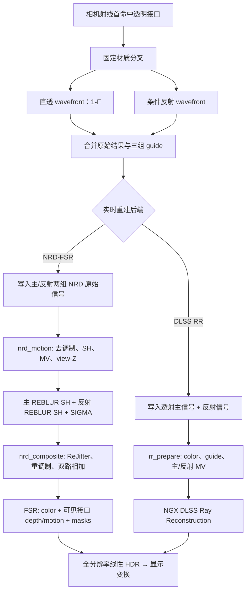

# 透明渲染与实时重建

本文记录 Prime 当前透明主路径从首命中分叉，到 NRD-FSR 或 DLSS Ray Reconstruction
输出之间的完整数据流。重点是各阶段“谁拥有哪一种几何、信号和时间相位”，以及这些
契约为什么不能互换。

本文主要描述实时输出适配。参考累积截图与实时模式共用同一 wavefront 积分器，直接累积
两条材质模型分支之和，不经过 NRD、FSR 或 DLSS RR。

## 总体模型

透明主命中同时涉及三种不同意义的表面：

| 表面 | 含义 | 主要消费者 |
| --- | --- | --- |
| 可见接口 | 相机首先看到的玻璃、水或其他透明边界 | 最终轮廓、雾、FSR depth/motion、透明 mask |
| 透射替代表面 | 沿直透路径遇到的第一个可用非 delta 表面 | 主 NRD 历史或 RR 主表面 |
| 反射替代表面 | 沿条件反射路径遇到的第一个可用非 delta 表面或方向 | 反射 NRD 历史；RR 使用简化的反射运动 |

核心约束如下：

1. 可见接口始终拥有屏幕轮廓和最终重建的几何覆盖。
2. 透射与反射是两条独立的光传输信号，不能共用一个 NRD 历史。
3. NRD 的重投影坐标与 FSR 的亚像素抖动是两份并行契约。NRD 输出稳定照明，组合阶段
   只给稳定信号恢复当前 FSR 相位。
4. 当前帧材质、法线、粗糙度和 view-Z 已经由带抖动的相机射线采样，不能再随 NRD
   信号平移一次。
5. NRD-FSR 与 DLSS RR 是互斥的完整实时后端；它们共享积分结果，但使用不同的输出适配。



## 1. 首个透明接口的固定分叉

普通主命中继续使用一条 wavefront 路径。首个可见表面为透明接口时，
`primeInitializeTransparentWavefront` 复用同一次命中、材质翻译、闭包构造和局部视角，
然后调用透明适配层的 split 入口，固定产生：

- 槽 0：方向不变、响应为 `(1-F) × 表面透射因子` 的直透路径；
- 槽 1：条件反射路径。

两条路径分别保存 throughput、介质栈、采样维度、辐射和 guide 状态，并进入同一套
wavefront 队列。分支类别也进入 SER coherence hint，避免重排后丢失传输语义。

“第一个”严格指相机主射线的首个可见面。主射线先命中不透明面后遇到的透明面不会分叉。
分支后续再次命中透明材质时固定直透，不递归扩张为路径树。首面反射响应已经包含 `F`，
直透响应使用互补权重 `1-F`；两支都执行，所以不再乘随机分支选择概率。

直透支和所有后续透明顶点都是纯 delta 事件，不执行 NEE，也不增加 Russian roulette
深度。首面反射为零粗糙度时也是 delta；有粗糙度时保留 RoboCute 条件 GGX 反射的
sample/eval/PDF 和反射 NEE/MIS。

### 材质语义

- 玻璃每个表面命中乘 `mix(白, linear Rec.2020 纹理 RGB, alpha)`，不进入介质栈；
  厚玻璃通常在进入、退出表面各滤色一次。
- 水面因子恒为白色且不折射，只在进入/退出时更新介质栈；已有实测水吸收继续按实际
  水中路径长度应用。
- 玻璃和水在首面之后不再乘 Fresnel。IOR 只参与相机首透明面的反射能量。
- 树叶薄壁透射保留原闭包，不按玻璃处理。

这是可解释但非物理的路径历史相关材质模型。原始积分器仍可对这个明确定义的有限反弹
模型给出无额外统计偏差的估计；该声明不等于真实物理正确，也不适用于实时重建结果。

### NEE 透明滤光

NEE 阴影 payload 同时携带 RGB 透射率、带符号水中距离和真实遮挡距离：

- 每个玻璃候选命中乘一次表面滤色，然后忽略该交点继续遍历；
- 水边界只累计带符号的剩余距离。起点在水中时以 `tMax` 初始化，进入边界加
  `tMax-t`，退出边界减 `tMax-t`，最终钳制到 `[0,tMax]` 后计算体积透射；
- 加减和不依赖 any-hit 调用顺序；畸形边界通过末端钳制避免负吸收或能量放大；
- 不透明面以及通过 alpha 测试的 cutout 保持真实遮挡，只有它们更新 SIGMA penumbra
  使用的遮挡距离。

玻璃和水的 RGB 透射预乘到太阳或面光源 radiance；标量 visibility 只表示真实遮挡。
阴影路径不计算透明面的后续 Fresnel 损失或反射分支。

### 分支辐射的归属

分支完成后，`primeResolveTransparentWavefrontResult` 把结果组织为：

| `PrimeIntegrationResult` 字段 | 透明像素中的含义 |
| --- | --- |
| `radiance.diffuse/specular` | 直透分支的辐射 |
| `reflectionDiffuseRadiance/reflectionSpecularRadiance` | 条件反射分支的辐射 |
| `guides` | 真实可见接口 |
| `transmissionGuides` | 透射替代表面 |
| `reflectionGuides` | 反射替代表面或方向 |

这里的 diffuse/specular 首先是重建信号分类，不表示透明接口本身只发生某一种事件。
例如 RR 输出适配会把整个透射分支并入主信号，把整个反射分支并入 specular 信号。

## 2. PSR guide 的构造

NRD 不能用玻璃接口的位置重投影玻璃后的照明，也不能用同一个位置同时描述透射和反射。
Prime 因此在已有分支遍历中捕获第一个可用非 delta 表面，不额外发射 guide ray。

分支穿过一串 delta 接口时，`PrimeQueuedPsrState` 以首段方向、累计路径长度和反射旋转
保存一个最多八层的有界链。遇到目标表面后构造：

```text
virtualPosition = firstDirection * totalPathLength
virtualNormal   = accumulatedReflectionTransform(targetNormal)
```

透射分支还计算目标平面与可见主射线的交点距离：

```text
anchorDistance =
    dot(target - camera, targetNormal)
    / dot(visiblePrimaryDirection, targetNormal)
```

这个 anchor 让直透路径的目标深度锚定在当前像素的可见主射线上。相机静止时，它投影回
当前带抖动样本位置，避免把虚拟 guide 的路径距离误报为物体运动。

如果没有遇到有效替代表面、delta 链溢出或平面交点退化，guide 回退到真实可见接口。
回退只影响重建 guide，不截断或伪造原始传输。

不同后端启用的 guide 不同：

| 后端 | 透射 PSR | 反射 PSR |
| --- | --- | --- |
| NRD-FSR | 启用 | 启用 |
| DLSS RR | 启用 | 不单独捕获；由可见接口和反射首段构造 reflection MV |
| 禁用后处理 | 禁用 | 禁用 |

## 3. 公共输出边界

`wavefront_output.glsl` 是积分器与实时重建之间的适配层。积分器只返回一个原始模型样本；
这里才根据后端把它编码为 NRD 或 RR 所需资源。

所有实时后端共享以下规则：

- 辐射是 D65、线性 Rec.2020、scene-referred HDR；
- 相机样本位置为 `pixelCenter + currentJitterPixels`；
- 数值、距离和 albedo 在写入 FP16/外部 SDK 边界前完成有限性与范围处理；
- 天空和确定性发光保存在 stable radiance 中，不建立第二份时间历史；
- 真实可见接口信息单独保留，不能被透射 PSR 覆盖。

后端选择发生在帧计划和资源创建阶段。`RealtimePostProcessor` 为 NRD-FSR 和 DLSS RR
提供相同的 frame token、jitter、reset、raw frame 和全分辨率线性 HDR 输出接口，但两套
资源与命令流不同时运行。

## 4. NRD-FSR 路径

### 4.1 Raygen 写入两组独立信号

NRD 模式启用 SH 输入。Raygen 写出两套完整的原始资源：

| 主 REBLUR 输入 | 反射 REBLUR 输入 |
| --- | --- |
| 透射辐射；普通像素则为普通主信号 | 透明条件反射辐射；其他像素无效 |
| 透射 PSR position/normal/roughness/material | 反射 PSR position/normal/roughness/material |
| diffuse/specular albedo 和 hit distance | 独立 albedo 和 hit distance |
| diffuse/specular 有效方向 | 独立有效方向 |

可见接口另外写入 `primeNrdDisplayPosition`：

- `xyz`：相机到真实可见接口的位置；天空为零；
- `w`：可见材质 flags 的 bit 表示。

因此 NRD 可以在虚拟表面上稳定两条照明历史，而组合和 FSR 仍知道屏幕上真正可见的是
哪一个接口。

反射 guide 无效时只把 `reflectionMaterial.a` 写为负值。`nrd_motion.comp` 在读取其他
反射资源前检查这个 marker，并把整条分支清为空输入，避免读取未定义的 companion 数据。

### 4.2 `nrd_motion.comp` 的输入准备

`primePrepareBranch` 分别处理主分支和反射分支。其输出遵循 NRD 4.17.4 的
`REBLUR_DIFFUSE_SPECULAR_SH` 契约：

1. 用分支自己的 position、normal、roughness 和 material 计算 view-Z 与重投影。
2. 运动向量满足 `old = new + MV`：

   ```text
   MV.xy = (previousUv - currentSampleUv) * renderExtent
   MV.z  = previousViewZ - currentViewZ
   ```

   NRD common settings 再用 `1 / renderExtent` 缩放 XY。方向型反射 guide 使用
   `w = 0` 投影且 `MV.z = 0`。
3. noisy diffuse/specular 分别除以对应 albedo，得到去调制照明。
4. SH0 保存照明的 YCoCg、归一化 hit distance；SH1 保存
   `effectiveDirection * luminance`。
5. 法线、线性粗糙度和 NRD material ID 被打包到 normal/roughness。

`currentSampleUv` 明确包含本帧 jitter。静止几何用非抖动历史矩阵投影后应回到这个 sample
UV，所以其物体运动为零；不能再减像素中心，否则 Halton 偏移会泄漏进每个静止 MV。

### 4.3 FSR guide 与 NRD guide 分离

同一 pass 中的 `primePrepareFsrGuide` 不读取透射或反射 PSR，而只读取
`primeNrdDisplayPosition`：

- 有表面时，depth 来自真实可见接口的 view-Z；
- motion 来自真实可见接口上一帧投影；
- 天空 depth 为 0，motion 只描述相机旋转。

这是最重要的分层之一：NRD 重投影“照明属于哪个虚拟表面”，FSR 重建“屏幕上哪个真实
表面覆盖这个像素”。把两者统一成一个 position 会让玻璃内部与边框产生相对滑动。

### 4.4 两个 REBLUR SH 历史

一个 NRD instance 内含：

- 主 `REBLUR_DIFFUSE_SPECULAR_SH`：普通表面和透明透射 PSR；
- 反射 `REBLUR_DIFFUSE_SPECULAR_SH`：只处理透明条件反射；
- `SIGMA_SHADOW`：普通主表面的太阳可见性。

主 REBLUR 最多积累 63 帧主历史、63 帧 stabilized history 和 10 帧 fast history。反射
REBLUR 保留 63 帧主历史，但 stabilized history 上限为 10；粗糙度低于 0.1 时启用
responsive accumulation，最低积累 3 帧。两者都使用 4 帧 history fix、5×5 hit-distance
重建和 1.5 的 sporadic-outlier relative scale。

NRD 接收当前与上一帧 jitter，但输出仍是为时间稳定设计的 SH 照明。它不能直接作为 FSR
当前带抖动颜色提交，透明表面尤其会暴露“边框在抖、内部照明不抖”的相位差。

### 4.5 组合与透明相位恢复

`nrd_composite.comp` 负责三件事：

1. 按 NRD 官方 SH/SG 规则 Resolve 和 ReJitter；
2. 用当前材质 albedo 重调制照明；
3. 对透明像素恢复 FSR 需要的当前亚像素相位。

普通不透明像素在本像素执行一次 resolve。透明像素只平移 stabilized SH 信号，不平移
当前 guide。设输出像素为 `x`，当前 jitter 为 `j`：

```text
base = x + floor(j)
f    = fract(j)
signal taps = base + {(0,0), (1,0), (0,1), (1,1)}
```

四个 tap 分别读取 SH0/SH1，但全部使用 `x` 处同一份当前 normal、roughness、view、
view-Z、material 和 albedo。每个 tap 独立执行：

```text
unpack SH
→ SG diffuse/specular resolve
→ official ReJitter scale
→ diffuse/specular remodulation
```

最后才对四个已经 resolve、已经重调制的颜色做双线性插值。不能先插值 SH 再做非线性
resolve，也不能从相邻像素取 roughness/material；前者会改变 SG 非线性结果，后者会在
粗糙/镜面交界制造过亮闪边。

当前 guide 本身已经由 `pixelCenter + j` 的射线生成。若 guide 和 SH 一起平移，jitter 会
被应用两次，内部相位幅度会达到期望的约 1.6～2 倍。

### 4.6 边界覆盖过滤

普通双线性 SH 平移会跨越树叶 cutout、天空或其他深度不连续面，表现为反射白边。透明
组合因此为每个 signal tap 重建其在当前 guide 栅格上的连续覆盖：

```text
guidePosition = signalPixel - currentJitterPixels
```

guide 样本只有同时满足以下条件才与中心表面兼容：

- 分支 marker 有效；
- NRD material ID 相同；
- view-Z 差不超过两者尺度的 1%，另加 `1e-4` 绝对裕量。

四个 inverse-jitter 2×2 footprint 合并为一个 3×3 compatibility grid，避免重复查询。
原始双线性权重乘以 `[0, 1]` 连续 coverage 后重新归一化；总有效权重接近零时才回退到中心
信号。连续 coverage 避免了硬 0/1 tap 切换本身造成的时间闪烁。

过滤只决定某个稳定 SH tap 是否属于中心表面。法线与粗糙度仍来自中心当前 guide，不能
用 coverage 把相邻几何的非线性材质状态混入。

### 4.7 重调制、合成和大气

每条分支的 resolved diffuse/specular 分别乘回自己的 albedo。主分支还加入 SIGMA
过滤后的太阳信号，然后：

```text
linearHDR =
    primarySurface
    + reflectionSurface
    + stableRadiance
```

大气透射和 inscatter 按真实可见接口距离应用。天空只返回 stable radiance，不读取
REBLUR 的旧表面历史。最终写入 FSR 的仍是线性 Rec.2020 HDR，Oklab 显示变换必须留在
超分之后。

### 4.8 FSR 输入

FSR 接收：

| 输入 | Prime 契约 |
| --- | --- |
| color | 上述 NRD composite，渲染分辨率线性 HDR |
| depth | 可见接口 reversed-infinite depth：`near / viewZ`；天空为 0 |
| motion | `previousUv - currentSampleUv`，归一化 UV |
| reactive mask | 当前透明、树叶和普通材质都为 0 |
| transparency/composition mask | 透明材质为 1；动画纹理为 0.75；其他为 0 |

主机把 motion scale 设为渲染宽高，使归一化 UV motion 在 FSR 内恢复为像素。Prime
raygen 使用 `pixelCenter + j`，而 FSR API 的 jitter offset 表示投影位移，因此跨 API
边界时提交 `-j`。

透明材质使用 T&C mask，而不是接近 1 的 reactive mask。T&C 让 FSR 对颜色运动与几何
运动不完全一致的反射/透射使用较软历史；高 reactive 会直接丢弃历史并重新暴露相机
jitter。树叶拥有匹配的 depth/motion，不标 T&C，以保留 FSR 的 thin-feature lock。

FSR 3.1.4 输出全分辨率线性 HDR，随后 Prime 执行线性 Rec.2020 到显示 sRGB 的 Oklab
变换。

## 5. DLSS Ray Reconstruction 路径

DLSS RR 是另一条完整后端，不先运行 NRD，也不再运行 FSR。它与 NRD-FSR 共享透明材质
分叉，但输出适配不同。

### 5.1 透明信号分组

RR 只有一组主表面输入和一组 reflection motion，不能像 Prime 的 NRD 后端那样提交两套
独立 REBLUR guide。透明结果因此被组织为：

```text
RR primary/noisy-diffuse = transmission.diffuse + transmission.specular
RR specular              = reflection.diffuse + reflection.specular
```

如果透射分支存在有效 PSR 和 anchor：

- 主 position 使用透射目标的 anchor，但沿真实可见主射线放置；
- 主 normal/roughness 使用透射替代表面；
- diffuse albedo 使用透射替代表面；
- specular albedo 和反射粗糙度来自真实可见接口；
- 可见接口距离继续单独保存，用于大气和反射运动。

没有有效透射 PSR 时，主 guide 回退到真实可见接口。RR 模式不捕获独立反射 PSR，避免
维护一套 SDK 无法直接接收的第二主表面。

### 5.2 `rr_prepare.comp`

RR prepare pass 把 raygen scratch 转成 NGX 的低分辨率输入：

- `inputColor`：透射、反射、太阳和 stable radiance 的模型总和，再按可见接口应用大气；
- diffuse/specular albedo：RGBA16F；
- normal/roughness：RGBA16F 世界法线与线性粗糙度；
- linear depth：R32F 正 view-Z，天空使用 65504；
- primary motion：RG16F 归一化 UV；
- reflection motion：RG16F 归一化 UV。

主 motion 与 NRD/FSR 同样满足 `previousUv - currentSampleUv`。当前 sample UV 包含 jitter，
所以静止表面和静止天空的 motion 为零。NGX 接收低分辨率 motion，并用渲染宽高作为
motion scale。

平滑反射满足以下条件时使用独立 reflection motion：

```text
reflectionHitDistance > 1e-3
and visibleInterfaceRoughness < 0.25
```

其虚拟位置沿可见主射线放在：

```text
visibleInterfaceDistance + reflectionHitDistance
```

然后用上一帧矩阵投影。粗糙反射或缺少有效 hit distance 时回退到 primary motion，因为
此时单一尖锐虚像并不是可靠 guide。

### 5.3 当前未提交的可选 RR 输入

Prime 当前明确把以下 NGX 输入设为 null：

- `Color Before Transparency`；
- `Specular Hit Distance`。

原因是 Prime 的透明主路径不是“先画不透明场景、再叠加透明层”的 raster overlay。
透射和反射已经在路径积分器内条件分叉，没有一张语义真实的 pre-transparency color。
同时，平滑反射直接提交 virtual reflection motion，已经替代通过 hit distance 让 SDK
重建反射运动的方案。

因此现有概念不能解释成“玻璃后的颜色绕过 RR”。透射总辐射位于 `inputColor`，并由透射
主 guide 参与 RR；反射总辐射位于同一输入颜色中，同时获得独立 reflection motion。

### 5.4 NGX 调度与输出

NGX feature 使用：

- unified denoise mode；
- packed roughness；
- linear depth；
- HDR；
- low-resolution motion vectors。

RR 使用至少 64 相位的 Halton jitter 周期，提交给 NGX 的 jitter 同样是 ray sample jitter
的相反数。NGX 直接生成全分辨率线性 HDR，之后只运行 Prime 显示变换。

如果平台、扩展、NGX 初始化、optimal-size 查询或 feature 创建失败，renderer 在本次会话
回退到 NRD-FSR，并重建与新后端匹配的资源和历史。

## 6. 时间历史与副作用边界

两套后端都遵循 prepare/commit：

1. 纯状态根据相机、场景 revision、纹理 revision、时间和 reset 请求产生 frame plan；
2. frame token 固定本帧 index、jitter、history camera 和 restart；
3. Vulkan 外壳录制 ray tracing、重建和显示命令；
4. 只有命令缓冲真正提交成功后，NRD、FSR 或 RR 历史才推进；
5. 录制失败、取消或未提交的 token 被 abandon，不得污染下一帧。

算法边界尽量保持显式：

- 分支采样、PSR 数学、输入约定和状态转移位于函数式核心；
- image load/store、barrier、descriptor、native SDK 调用和资源生命周期位于 GPU/native
  外壳；
- NRD、FSR 和 NGX 的内部历史属于外部边界，Prime 只拥有它们的输入版本与提交时机。

## 7. 关键验证

修改这条路径时至少要保持以下测试层级：

| 层级 | 主要检查 |
| --- | --- |
| `PrimeBsdfGpuTest` | 首面 `1-F` 直透、粗糙反射 sample/eval/PDF、后续确定性直透、玻璃滤色和水栈 |
| `PrimeProductionMathGpuTest` | 玻璃滤色乘积、乱序水段、PSR 数学、NRD pack/demod/ReJitter、FSR depth/motion/mask |
| 管线与发行契约 | 两个 any-hit stage、六个 hit group、29 个发行 SPIR-V 及全部模块验证 |
| `DlssRrMotionContractTest` | jitter 符号、静止零 MV、相机运动、平滑反射 virtual MV |
| `DlssRrNativeContractTest` | Java/native ABI、图像格式和尺寸 |
| `NrdInputSemanticValidator` | raw/prepared 两分支的实际输入语义 |
| F10 replay | 生产 wavefront、NRD 输入、post-NRD 相位幅度与边界残差 |

属性测试不能用搜索源码文本证明行为。高风险约定必须比较可执行数学结果、真实 shader
产物、固定宽度 ABI 或 replay 捕获。

透明相位回归应分别观察：

- 透明/染色厚玻璃是否逐面滤色，相机位于玻璃内和叠层玻璃是否保持直透；
- 粗糙玻璃首面是否仍有 GGX 反射，玻璃与水组合是否只让水产生段吸收；
- 水下太阳和方块面光是否按水中距离滤光；
- 玻璃后的不透明遮挡是否仍遮光，SIGMA penumbra 是否只使用真实遮挡距离；
- 玻璃边框与内部透射内容是否同相位移动；
- 粗糙/镜面交界是否出现过亮闪边；
- 树叶 cutout 或天空反射是否出现白色外扩；
- 边界与内部 jitter 幅度是否接近同一标尺；
- 静止相机下 NRD、FSR 和 RR motion 是否为零。

## 8. 性能边界

透明 NRD 组合的主要额外成本来自每条有效分支四次独立 SG resolve。它是“每个稳定 SH
tap 必须在同一当前 guide 下完成非线性 resolve”的正确性成本，不能安全地合并成一次。

当前实现已共享：

- 中心 material、albedo、normal、roughness、view 和 view-Z；
- ReJitter 的四邻域法线、材质类和 view-Z，coverage 不再重复读取其中的法线与深度；
- 四个 coverage footprint 重叠的 3×3 compatibility，以 9-bit mask 保存并共用逆抖动权重；
- beauty 与镜面重调制诊断各自只计算所需结果，四个 tap resolve 后立即加权累积。

因此普通不透明像素仍只 resolve 一次；额外四 tap 路径只在可见材质为 transmissive 时
启用；非透射像素不再探测本应无效的反射分支。进一步优化必须证明不改变 per-tap
resolve、中心 guide、不连续面过滤和权重归一化的数学结果。实际收益应以 GPU benchmark
为准，不能只用源码 image-load 数量代替耗时。

## 9. 代码索引

| 阶段 | 主要文件 |
| --- | --- |
| 透明 BSDF split | `shaders/bsdf.glsl`, `shaders/integrator.glsl` |
| NEE 玻璃/水滤光 | `shaders/shadow.rahit`, `shaders/shadow_payload.glsl`, `shaders/transparent_material.glsl` |
| wavefront 分叉、推进与合并 | `shaders/wavefront.rgen`, `shaders/wavefront_state.glsl` |
| PSR 数学 | `shaders/queued_psr_math.glsl` |
| 后端输出适配 | `shaders/wavefront_output.glsl` |
| NRD/FSR 输入准备 | `shaders/nrd_motion.comp`, `shaders/fsr_input.glsl` |
| NRD SH 官方应用侧解析 | `shaders/nrd_sh.glsl` |
| 透明 phase restore 与组合 | `shaders/nrd_composite.comp` |
| NRD native 配置 | `native/nrd/prime_nrd_bridge.cpp` |
| FSR 调度 | `NrdFsrPostProcessor`, `Fsr3Upscaler`, `FsrDispatchPlan` |
| RR 输入准备 | `shaders/rr_prepare.comp`, `DlssRrPreparePass` |
| RR NGX 边界 | `DlssRrPostProcessor`, `DlssRrNative`, `native/dlss_rr/prime_dlss_rr_bridge.cpp` |

更一般的状态、所有权与副作用规则见[纯函数式架构](纯函数式架构.md)，渲染器其他稳定
边界见[渲染实现](渲染实现.md)。
